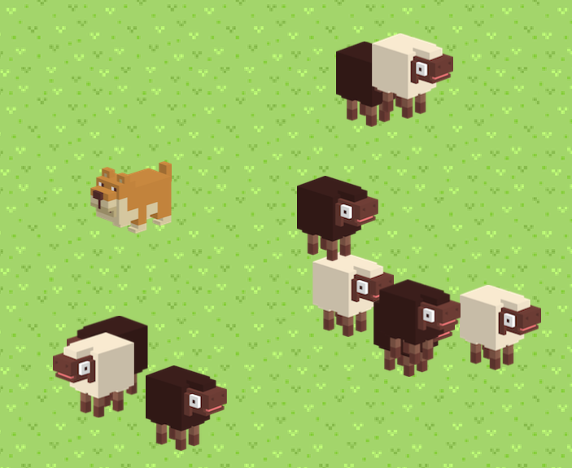

# Flock Behaviour

- Fenton runs after the mouse pointer. he goes slower when he is nearer the mouse.
- The sheep run away from Fenton. Sheep run slower when Fenton is further away.

[Play the demo](https://kokodoko.github.io/FlockBehaviour/)

### About the code

- The speed and direction of Fenton and the sheep is calculated [using vector math](https://www.mathsisfun.com/algebra/vectors.html)
- The sheep go slower when Fenton is further by using [inverse proportion](https://www.mathsisfun.com/algebra/directly-inversely-proportional.html)
- Sprites are placed using semantic DOM elements such as `<sheep>`. Use CSS to style the sprite.
- Sprites are animated with [CSS transform](https://developer.mozilla.org/en/docs/Web/CSS/transform) in a [simple game loop](https://developer.mozilla.org/en-US/docs/Web/API/window/requestAnimationFrame).

### How to run locally

- Open [index.html](https://kokodoko.github.io/FlockBehaviour/) in localhost

### How to edit

- Install Typescript `npm install -g typescript`
- Transpile the code in watch mode by typing `tsc -w` in the terminal